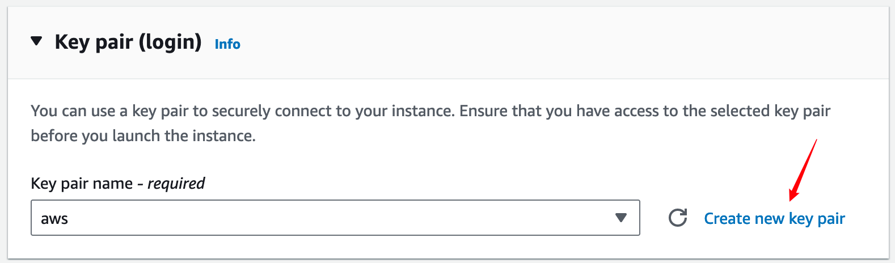

# AWS Setup Instructions #

Here are the steps for how to get setup for running on AWS.

NOTE: __Please don't forget to SHUT DOWN your instances when you're done for the day to avoid burning through money overnight!__

### Creating a VM ###

1. Log in to the [AWS EC2 dashboard](https://us-west-2.console.aws.amazon.com/ec2/home?region=us-west-2#Home) for the `us-west-2` region and click on the button that says `Launch instance`.


2. Choose the `Ubuntu Server 22.04 LTS (HVM), SSD Volume Type` AMI, or whichever Ubuntu distribution has the highest number. Your instance type doesn't NEED to be Ubuntu, but most of the support you'll find online is for it


3. Choose an instance type. Which you'll need will depend on the resources your scripts need, specifically 1) how many CPUs you need and 2) how much RAM you need. If you don't know, check the `resources_cheatsheet.md`. If these two parameters are correct, your jobs will probably run. Different instances might cost more or less based on how fast the CPUs are or other factors, but they will all run the jobs.


4. Change the size of the volume to accomodate the packages you will need to install and the data you'll need to store. [This can be expanded](https://docs.aws.amazon.com/AWSEC2/latest/UserGuide/requesting-ebs-volume-modifications.html) (but not contracted) later:


5. You will need a key pair to access your instance. In `Key pair (login)` section, click `Create a new key pair` and give it whatever name you'd like. This will download a keyfile to your computer called `<key_name>.pem` which you will use to login to the VM instance you are about to create. Make sure you follow the instructions to change the permissions of your key file by running `chmod 400 path/to/key_name.pem`. Finally, you can launch your instance.



__Note: `m6i.2xlarge` instances, for example, cost $0.384 / hour, so leaving one running for a whole day will consume $9.216 worth of your AWS coupon. Remmeber to shut off the instance when you're not using it!__

6. Now that you've created your VM, you should be able to __SSH__ into it. You need the public IPv4 DNS name to SSH into it, which you can find by navigating to your instance's page and then clicking the `Connect` button, followed by selecting the SSH tab (note, it may take a moment for the instance to startup and be assigned an IP address):


Once you have the IP address, you can login to the instance by running this command:
~~~~
ssh -i path/to/key_name.pem ubuntu@<public_dns_name>
~~~~

### Associating an Elastic IP ###

7. If yould like a more convenient way of logging in, navigate to the Elastic IP section of the AWS console under `Privacy and Secrity`. Click the orange `Allocate Elastic IP address` button. Keep the defaults, scroll to the bottom, and press `Allocate`. Click on the new Elastic IP address. Click the orange `Associate IP Address` button at the top. Select your instance and click `Associate`. Your instance will now have a permanent IP address.

8. Add the following template code to your `.ssh/config` file:

```
Host <your-host>
    Hostname <your-elastic-ip-address>
    User ubuntu
    IdentityFile path/to/key_name.pem 
    Port 22
```

Once you have this set up, you can __SSH__ into the instance using 
~~~~
ssh <your-host>
~~~~

### Moving your files ###
Presumably, you have files on the HPC that you need moved to the AWS instance you've just created. The firewall won't let you connect from an AWS instance, so you'll have to log into the HPC and transfer files from there. Your options are either __scp__ or __rsync__. There are lots of examples of how to use these online. If you're copying large files, or large numbers of files, you should use __rsync__ because it will let you resume if the connection drops. Starting from your local machine, you'll need to:

1. Transfer your key to the HCP like so
~~~
scp path/to/key_name.pem <hcp>:~/.ssh
~~~

2. Log into the HCP and add the host config to your `.ssh/config` on your HPC. You should add the same host config as you did on your personal machine.

3. Transfer the files you want like so
~~~
rsync -rzP path/to/local/dir <your-host>:/path/to/remote/dir
~~~
`r` makes it recursive so you can copy a directory, `z` compresses files during the transfer, and `P` shows progress and tracks progress so it can restart if the connection is lost. This can take a long time, up to hours if your files are large enough, and might be best to run it in a batch script.

When you want to transfer files between your personal machine and the AWS instance, you can use __scp__ or __rsync__ but with the argument order switched like
~~~
rsync -rzP <your-host>:/path/to/remote/dir path/to/local/dir
~~~

### Running Scripts ###

Running a script on the AWS instance is like running them on your local machine. You'll need to set up the packages you need before you can run anything.

Also, scripts run directly from the terminal (__docker__ is an exception) will not stay alive when you disconnect your __SSH__ session. There are a few ways to handle this, and you're free to pick your favorite. I'd recommend [__tmux__](https://github.com/tmux/tmux/wiki), which is probably installed by default on your instance. If not, run `sudo apt-get tmux`. __tmux__ works in "sessions" that you open, that will stay running even when you're not connected to the instance, and that you can "attach" to the next time you log in. To start a new __tmux__ session, run 
~~~
tmux new -s <my-session>
~~~
to open a new session. Once you're inside, it will act almost exactly like your normal terminal but it will stay running in the background until you close it explicitly. I say almost because scrolling, copying, and a few other things are more complicated and it's helpful to use a [cheatsheet](https://tmuxcheatsheet.com/). When you're done working on that session but don't want to close it, press `<CTRL> + b` then `d`. The next time you want to access your session, run 
~~~
tmux attach -t <my-session>
~~~
You can open as many sessions as you'd like, and see the names of sessions you have open with 
~~~
tmux ls
~~~
Logging off won't get rid of sessions, so you'll need to close them once you're done with
~~~
tmux kill-session -t <my-session>
~~~
or they'll keep running until you stop the instance.

### Stopping the VM ###

10. You can stop the VM by navigating to the instance page, clicking "Instance state", and then selecting "Stop instance".


Note that terminating the instance will delete the instance and all associated files. Instances can be stopped in the AWS web console or by running `sudo shutdown -P now` while logged in.

